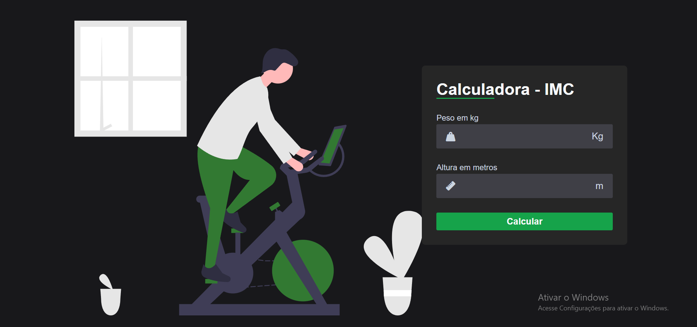

<h1 align="center"> Calculadora IMC </h1>

Programa responsivo desenvolvido utilizando JavaScript, HTML e CSS.  

  <a href="#-tecnologias">Tecnologias</a>&nbsp;&nbsp;&nbsp;|&nbsp;&nbsp;&nbsp;
  <a href="#-projeto">Projeto</a>

 

  

## 🚀 Tecnologias

Esse projeto foi desenvolvido com as seguintes tecnologias:

- HTML e CSS
- JavaScript
- Git e Github

## 💻 Projeto

Este projeto é uma página web que calcula seu IMC, de acordo com seu peso e altura, e retorna um resultado.
